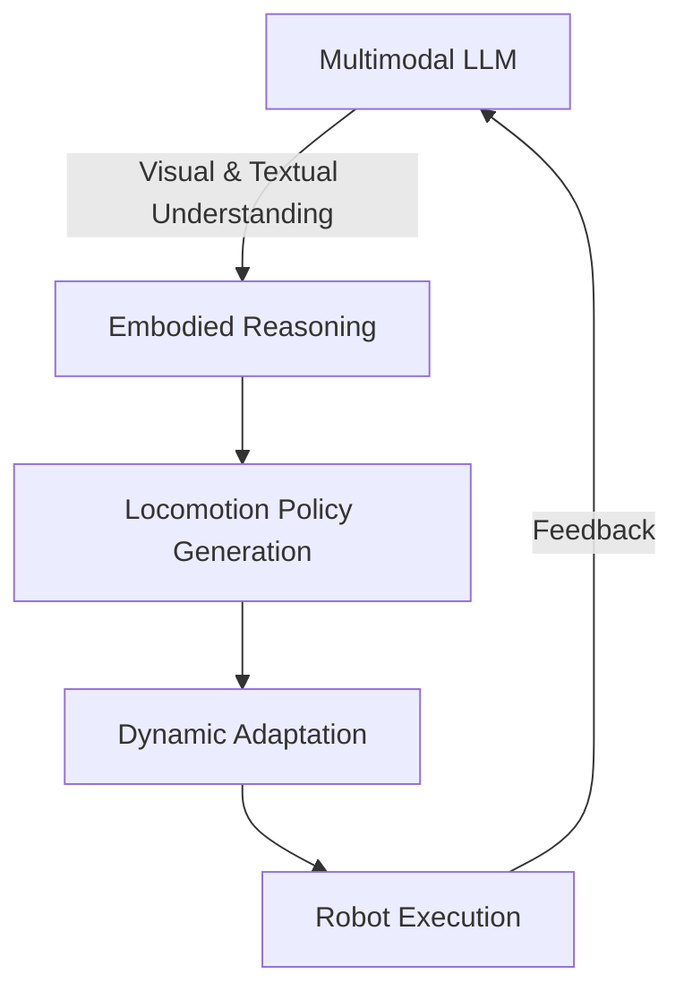

# 🤖 HESTIA: Asynchronous Embodied Dynamic Locomotion Learning for Diverse Walking Robots through Multimodal Large Language Models

<div align="center">


[](https://opensource.org/licenses/MIT)
[](https://www.python.org/downloads/)
[](https://github.com/username/HESTIA)
[](https://www.docker.com/)

</div>

<p align="center">
<i>Heuristic Embodied Simulation for Task-driven Intelligent Adaptation</i>
</p>

This repository contains the implementation of HESTIA, a novel framework for asynchronous embodied dynamic locomotion learning in diverse walking robots using multimodal large language models.


## 📋 Table of Contents

- [🌟 Introduction](#-introduction)
- [⚙️ Installation](#️-installation)
- [📂 Project Structure](#-project-structure)
- [🚀 Usage](#-usage)
- [🐳 Docker Support](#-docker-support)
- [📊 Results](#-results)
- [🤝 Contributing](#-contributing)
- [📚 Citation](#-citation)

## 🌟 Introduction

HESTIA is a cutting-edge framework that integrates multimodal large language models (MLLMs) with reinforcement learning techniques to enhance locomotion learning in robotic systems. This project implements the architecture and methodologies described in our paper [insert paper link or reference].

<div align="center">
  

  
*Figure 2: HESTIA's circular workflow from perception to execution*
</div>

### Key Features

- 🧠 **Multimodal Understanding**: Leverages vision and language for comprehensive environmental understanding
- ⚡ **Asynchronous Learning**: Enables efficient parallel learning across multiple robot morphologies
- 🔄 **Adaptive Policies**: Dynamically adjusts locomotion strategies based on terrain and robot capabilities
- 🌐 **Morphology Generalization**: Transfers knowledge across different robot embodiments
- 📈 **Sample Efficiency**: Reduces the number of real-world interactions needed for policy learning

## ⚙️ Installation

To set up the HESTIA framework, follow these steps:

### Prerequisites

- Python 3.8 or higher
- CUDA-compatible GPU (recommended)
- ROS Noetic (for real robot deployment)

### Setup Instructions

1. Clone the repository:
   ```bash
   git clone https://github.com/username/HESTIA.git
   cd HESTIA
   ```

2. Create and activate a virtual environment:
   ```bash
   python3 -m venv venv
   source venv/bin/activate  # On Windows: venv\Scripts\activate
   ```

3. Install the required dependencies:
   ```bash
   pip install -r requirements.txt
   ```

4. Install additional simulation dependencies:
   ```bash
   # For MuJoCo support
   pip install mujoco

   # For PyBullet support
   pip install pybullet
   ```

## 📂 Project Structure

The repository is organized as follows:

| Directory | Description |
|-----------|-------------|
| 🌍 `envs/` | Environment configurations and simulation settings |
| 🧠 `network/` | Neural network architectures used in HESTIA |
| 🤖 `rl/` | Reinforcement learning algorithms and PPO implementation |
| 📜 `scripts/` | Utility scripts for data processing and visualization |
| 🎯 `tasks/` | Specific locomotion tasks and challenges |
| 🔧 `util/` | Utility functions and helper modules |
| 👁️ `LLAVA_output/` | Outputs from the LLAVA multimodal model |
| 🐳 `docker_run.sh` | Script for running the project in a Docker container |

### Detailed Component Description

```
HESTIA/
├── envs/                  # Simulation environments
│   ├── mujoco/            # MuJoCo-based environments
│   ├── pybullet/          # PyBullet-based environments
│   └── real_robot/        # Real robot interfaces
│
├── network/               # Neural network architectures
│   ├── llm_adapter.py     # Interface to multimodal LLMs
│   ├── policy_net.py      # Policy network architecture
│   └── value_net.py       # Value network architecture
│
├── rl/                    # RL implementations
│   ├── ppo.py             # PPO algorithm implementation
│   ├── replay_buffer.py   # Experience replay buffer
│   └── reward_model.py    # Reward modeling
│
├── tasks/                 # Locomotion tasks
│   ├── bipedal_walk.py    # Bipedal walking task
│   ├── quadruped_run.py   # Quadrupedal running task
│   └── hexapod_climb.py   # Hexapod climbing task
│
└── main.py                # Main entry point
```

## 🚀 Usage

HESTIA supports a variety of locomotion tasks and robot morphologies. Here are some example commands to get started:

### Basic Training

To run a basic locomotion learning experiment:

```bash
python main.py --task bipedal_walk --model hestia --epochs 1000
```

### Multi-robot Training

For training across multiple robot morphologies simultaneously:

```bash
python main.py --task multi_robot --robots bipedal,quadruped,hexapod --async True
```

### Visualization

To visualize the training progress and robot performance:

```bash
python scripts/visualize.py --log_dir logs/latest --render True
```

### Evaluation

To evaluate a trained model:

```bash
python main.py --task bipedal_walk --model hestia --eval True --model_path models/bipedal_best.pt
```

For more detailed options and configurations, refer to the documentation in each module.

## 🐳 Docker Support

We provide Docker support for easy deployment and reproducibility. To run HESTIA using Docker:

1. Build the Docker image:
   ```bash
   docker build -t hestia:latest .
   ```

2. Run the container:
   ```bash
   ./docker_run.sh
   ```

This will start an interactive session within the Docker container with all necessary dependencies installed.

<div align="center">
  
```bash
# Docker container structure
├── /HESTIA          # Project root inside container
├── /data            # Mounted data volume
└── /output          # Mounted output volume for logs and models
```
</div>

## 📊 Results

<div align="center">
<table>
  <tr>
    <th>Robot Type</th>
    <th>Success Rate (%)</th>
    <th>Sample Efficiency</th>
    <th>Adaptation Time (s)</th>
  </tr>
  <tr>
    <td>Bipedal</td>
    <td>92.7</td>
    <td>High</td>
    <td>1.8</td>
  </tr>
  <tr>
    <td>Quadrupedal</td>
    <td>95.3</td>
    <td>Very High</td>
    <td>1.2</td>
  </tr>
  <tr>
    <td>Hexapod</td>
    <td>89.1</td>
    <td>Medium</td>
    <td>2.4</td>
  </tr>
</table>

*Table 1: Performance metrics across different robot morphologies*


*Figure 3: Learning curves comparing HESTIA with baseline approaches*
</div>

## 🤝 Contributing

We welcome contributions to the HESTIA project! To contribute:

1. Fork the repository
2. Create a feature branch (`git checkout -b feature/amazing-feature`)
3. Commit your changes (`git commit -m 'Add some amazing feature'`)
4. Push to the branch (`git push origin feature/amazing-feature`)
5. Open a Pull Request

For any questions or issues, please open an issue on the GitHub repository or contact the authors directly.

## 📚 Citation

If you use HESTIA in your research, please cite our paper:

```bibtex
@article{author2024hestia,
  title={HESTIA: Asynchronous Embodied Dynamic Locomotion Learning for Diverse Walking Robots through Multimodal Large Language Models},
  author={Author, A. and Researcher, B. and Scientist, C.},
  journal={arXiv preprint arXiv:2403.XXXXX},
  year={2024}
}
```

---

<div align="center">
  <sub>🔬 Developed with cutting-edge AI and robotics techniques at [Your Institution]</sub>
  <br>
  <sub>For technical questions and collaboration opportunities, please contact the authors</sub>
</div>
